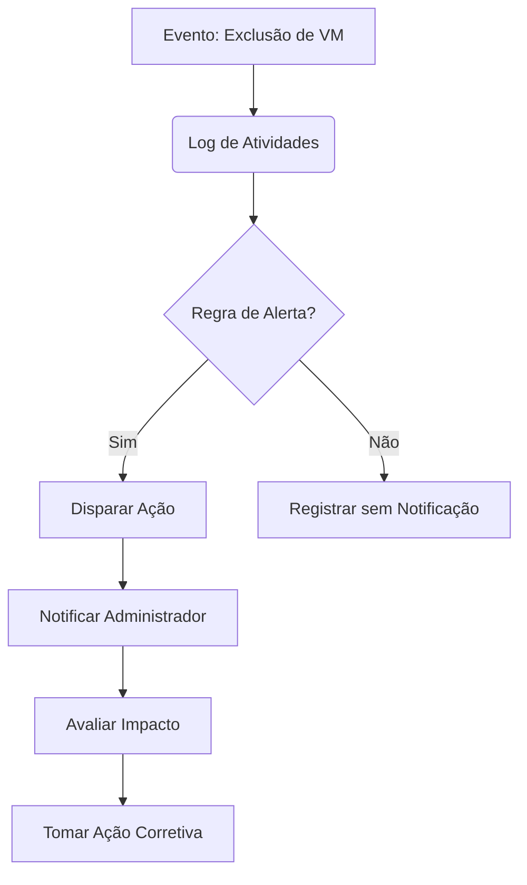

# Monitoramento de Recursos no Microsoft Azure - Foco em Máquinas Virtuais (VMs)

## Visão Geral
Este documento resume as principais funcionalidades de monitoramento no Azure, com ênfase em máquinas virtuais, especialmente para detectar e responder a eventos críticos como exclusão de VMs.

## Serviços Principais para Monitoramento

### 1. Azure Monitor
- **Função**: Serviço abrangente para coleta, análise e atuação sobre telemetria
- **Recursos-chave**:
  - Métricas em tempo real
  - Logs de atividades
  - Alertas configuráveis

### 2. Log de Atividades do Azure
- **O que registra**:
  - Operações de gerenciamento em nível de assinatura
  - Quem iniciou a operação
  - Quando ocorreu
  - Status da operação

### 3. Alertas do Azure
- **Tipos**:
  - Alertas de métrica
  - Alertas de log de atividades
  - Alertas de log (consultas)

## Configuração para Máquinas Virtuais

### Passo a Passo Básico
1. **Habilitar diagnóstico na VM**:
   ```bash
   az vm diagnostics set --resource-group MyResourceGroup --vm-name MyVM --settings settings.json
   ```
2. **Configurar alertas para exclusão**:
   - Navegar até "Monitor" > "Alertas" > "Nova regra de alerta"
   - Selecionar recurso (VM)
   - Condição: "Excluir Máquina Virtual"
   - Definir grupo de ações para notificação

### Exemplo: Consulta Kusto para Detectar Exclusões
```kusto
AzureActivity
| where OperationNameValue == "MICROSOFT.COMPUTE/VIRTUALMACHINES/DELETE"
| project TimeGenerated, Caller, ResourceGroup, SubscriptionId
```

## Melhores Práticas
- **Grupos de Ações**: Configurar notificações por email/SMS/webhook
- **RBAC**: Limitar permissões de exclusão
- **Backup**: Habilitar Azure Backup para VMs críticas
- **Tags**: Usar tags para organização e filtragem de alertas

## Dashboard Recomendado
Crie um dashboard no Azure Monitor com:
1. Status de saúde das VMs
2. Gráfico de operações de exclusão recentes
3. Alertas ativos
4. Utilização de recursos (CPU, memória, disco)

## Solução de Problemas Comuns
- **Alertas não disparando**: Verificar configurações de diagnóstico
- **Falsos positivos**: Ajustar limiares de alerta
- **Latência**: Permitir 5-15 minutos para propagação

## Recursos Adicionais
- [Documentação Oficial do Azure Monitor](https://docs.microsoft.com/azure/azure-monitor/)
- [Referência de Log de Atividades](https://docs.microsoft.com/azure/azure-monitor/platform/activity-log)
- [Modelos ARM para Monitoramento](https://azure.microsoft.com/resources/templates/)



> **Dica**: Para ambientes críticos, considere usar o Azure Policy para bloquear exclusões acidentais de VMs.
